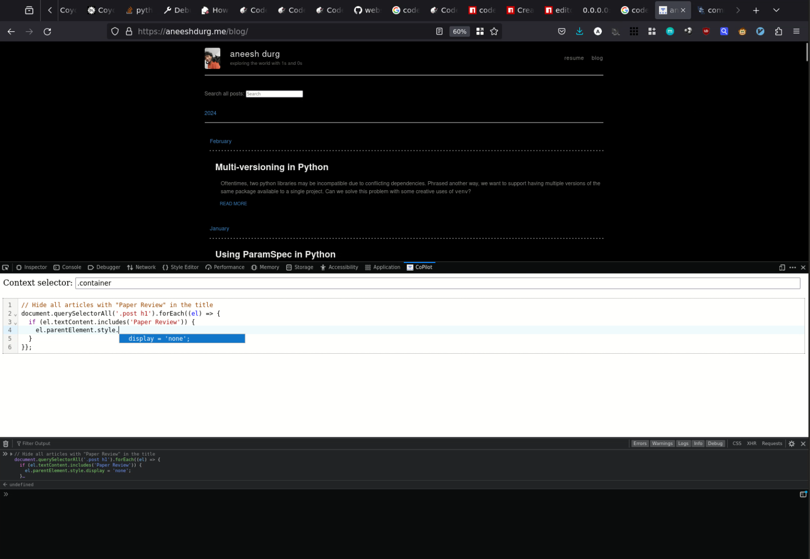

# firefox copilot

Integrate Github Copilot with Firefox devtools! Have you ever wanted to change the visibility of annoying elements on a website you were visiting but didn't know how, or couldn't be bother to script it up in the console? `ffcopilot` aims to make such tasks far more accesible by integrating Github Copilot. Click on the picture below to see a demo video. Note that this project is very much a work in progress.

The demo above shows usage of `ffcopilot` to generate code to hide blog posts matching a certain string.

## Usage

Open `firefox` navigate to `about:debugging`, click on `This Firefox` and then
`Load Temporary Add-on`. Then click on `manifest.json` from your local clone of
this repo.

You will then be able to open devtools on any page (right-click > Inspect), and
a panel labeled `CoPilot` should be visible.

## Limitations

The context provided to the completions is very basic. There is an input field where a query selector can be written to choose the elements that will be "visible" to the AI. If the provided selector yields too large of a payload to be used as context, only the first 250 lines of HTML are sent. In the future, I hope to make this more advanced by selecting content at the node level and filtering content with a smarter strategy (e.g. random sampling of nodes) to stay within the token limit while providing useful context.
